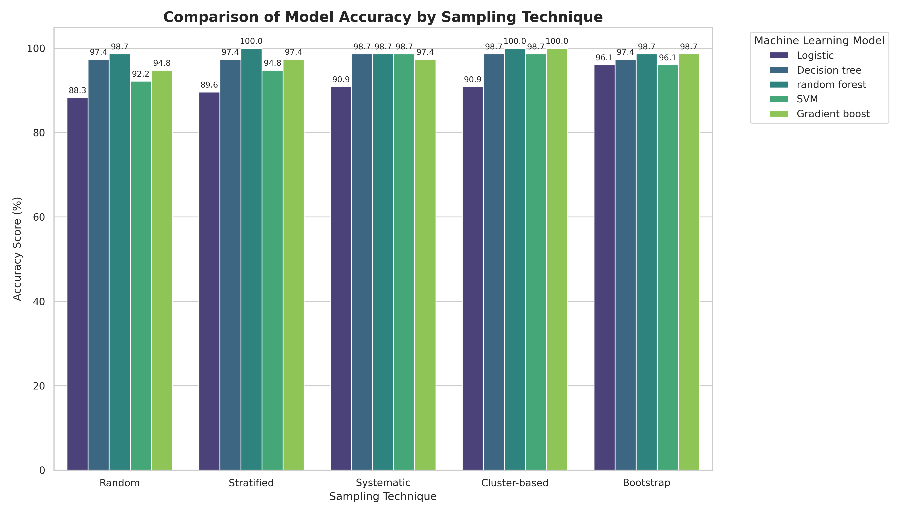

# Comparative Analysis of Sampling Techniques for Credit Card Fraud Detection

This repository contains the solution for a comparative analysis of different sampling techniques applied to a highly imbalanced Credit Card Fraud Detection dataset. The project evaluates how different sampling methods (Simple Random, Systematic, Stratified, Cluster, and Bootstrap) impact the accuracy of five different machine learning models.

## 📌 Project Overview
Credit card fraud datasets are inherently imbalanced, with legitimate transactions vastly outnumbering fraudulent ones. This imbalance often leads to biased models that perform poorly on the minority class (fraud). This project addresses the issue by:
1.  **Balancing the dataset** using Random Oversampling.
2.  **Generating five different samples** using various statistical sampling techniques.
3.  **Training five Machine Learning models** on each sample.
4.  **Comparing the accuracy** to determine the most effective sampling-model combination.

## 🛠️ Methodology

### 1. Data Preprocessing
* **Dataset:** Creditcard_data.csv (772 rows).
* **Class Imbalance:** Original data contained 763 non-fraud cases (Class 0) and only 9 fraud cases (Class 1).
* **Balancing Technique:** **Random Oversampling** was applied to the minority class to achieve a perfectly balanced dataset (763:763 ratio).

### 2. Sample Size Calculation
The sample size was determined using **Cochran’s Formula** with a 95% confidence level and a 5% margin of error:
\[ n = \frac{Z^2 \cdot p \cdot (1-p)}{E^2} \approx 385 \]

### 3. Sampling Techniques Applied
Five different samples were generated from the balanced dataset:
1.  **Simple Random Sampling:** Randomly selects \( n \) instances without replacement.
2.  **Systematic Sampling:** Selects every \( k \)-th instance from the dataset.
3.  **Stratified Sampling:** Divides the population into subgroups (classes) and samples proportionally from each.
4.  **Cluster Sampling:** Uses K-Means clustering to group data and selects entire clusters to form the sample.
5.  **Bootstrap Sampling:** Randomly samples \( n \) instances with replacement.

### 4. Machine Learning Models
The following models were trained on each of the five samples:
* **M1:** Logistic Regression
* **M2:** Decision Tree Classifier
* **M3:** Random Forest Classifier
* **M4:** Support Vector Machine (SVM)
* **M5:** Gradient Boosting Classifier

---

## 📊 Results

### Accuracy Table
The table below shows the accuracy (%) achieved by each model for every sampling technique:

| Sampling Technique | M1 (LogReg) | M2 (DecTree) | M3 (RandForest) | M4 (SVM) | M5 (GradBoost) |
| :--- | :---: | :---: | :---: | :---: | :---: |
| **Sampling1 (Simple Random)** | 88.31 | 97.40 | 98.70 | 92.21 | 94.81 |
| **Sampling2 (Systematic)** | 89.61 | 97.40 | **100.00** | 94.81 | 97.40 |
| **Sampling3 (Stratified)** | 90.91 | 98.70 | 98.70 | 98.70 | 97.40 |
| **Sampling4 (Cluster)** | 90.91 | 98.70 | **100.00** | 98.70 | **100.00** |
| **Sampling5 (Bootstrap)** | **96.10** | 97.40 | 98.70 | 96.10 | 98.70 |

### 💡 Conclusion: Best Sampling Technique per Model
Based on the experimental results, the following sampling techniques achieved the highest accuracy for each model:

* **Logistic Regression (M1):** Bootstrap Sampling (96.1%)
* **Decision Tree (M2):** Systematic Sampling (98.7%)
* **Random Forest (M3):** Stratified Sampling (100.0%)
* **SVM (M4):** Systematic Sampling (98.7%)
* **Gradient Boosting (M5):** Cluster Sampling (100.0%)

## 📈 Result Graph
The grouped bar chart below visually compares the performance of all models across the sampling techniques.

## 📂 Repository Structure
* `Creditcard_data.csv`: The original imbalanced dataset.
* `sampling_assignment_abhishek_panchal.py`: The complete Python script for data processing, sampling, and modeling.
* `sampling_assignment_results.csv`: The CSV file containing the final accuracy table.
* `sampling_model_comparison_graph.png`: The visualization of the results.
* `README.md`: Project documentation.

## 🚀 How to Run
1.  Clone the repository.
2.  Install dependencies: `pip install pandas numpy scikit-learn imbalanced-learn seaborn matplotlib`.
3.  Run the script: `python sampling_assignment_abhishek_panchal.py`.
